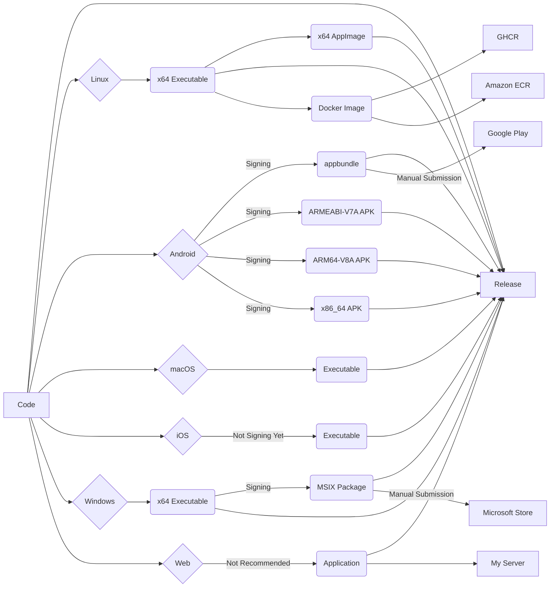

> [!WARNING]
> Any unlawful usage is strictly prohibited.

<div align="center">
  
</div>
<div align="center">

# Bitscoper Cyber ToolBox

A Flutter application consisting of IPv4 Subnet Scanner, mDNS Scanner, TCP Port Scanner, Route Tracer, Pinger, File Hash Calculator, String Hash Calculator, Base Encoder, Morse Code Translator, QR Code Generator, Open Graph Protocol Data Extractor, Series URI Crawler, DNS Record Retriever, WHOIS Retriever, and Wi-Fi Information Viewer.

[](https://github.com/bitscoper/Bitscoper_Cyber_ToolBox/actions/workflows/Build,%20Release,%20and%20Deploy.yaml)

  <table>
    <tbody>
      <tr>
        <td>
          <a href="https://apps.microsoft.com/detail/9n6r5lxczxl6">
            
          </a>
        </td>
        <td>
          <a href="https://play.google.com/store/apps/details?id=bitscoper.bitscoper_cyber_toolbox">
            
          </a>
        </td>
        <td>
          <a href="https://github.com/bitscoper/Bitscoper_Cyber_ToolBox/pkgs/container/bitscoper_cyber_toolbox/">
            
          </a>
        </td>
        <td>
          <a href="https://gallery.ecr.aws/n7r2f3q1/bitscoper/bitscoper_cyber_toolbox/">
            
          </a>
        </td>
      </tr>
    </tbody>
  </table>
</div>

## [Latest Release](https://github.com/bitscoper/Bitscoper_Cyber_ToolBox/releases/latest/)

<div align="center">



  <table>
    <tr>
      <th colspan="2">Platform</th>
      <th colspan="2">Builds</th>
      <th>Debug Symbols</th>
      <th>Stores / Repositories / Deployments</th>
    </tr>
    <tr>
      <th rowspan="2" colspan="2">Linux</th>
      <td colspan="2">
        <a href="https://github.com/bitscoper/Bitscoper_Cyber_ToolBox/releases/latest/download/Linux_x64_Executable.zip">Linux_x64_Executable.zip</a>
      </td>
      <td rowspan="2">
        <a href="https://github.com/bitscoper/Bitscoper_Cyber_ToolBox/releases/latest/download/Linux_x64_Debug_Symbols.zip">ZIP</a>
      </td>
      <td rowspan="2">-</td>
    </tr>
    <tr>
      <td colspan="2">
        <a href="https://github.com/bitscoper/Bitscoper_Cyber_ToolBox/releases/latest/download/Bitscoper_Cyber_ToolBox-15.1.2-x64.AppImage">Bitscoper_Cyber_ToolBox-15.1.2-x64.AppImage</a>
      </td>
    </tr>
    <tr>
      <th rowspan="4" width="46">Android</th>
      <th>appbundle</th>
      <td colspan="2">
        <a href="https://github.com/bitscoper/Bitscoper_Cyber_ToolBox/releases/latest/download/Android_appbundle.zip">Android_appbundle.zip</a>
      </td>
      <td>
        <a href="https://github.com/bitscoper/Bitscoper_Cyber_ToolBox/releases/latest/download/Android_appbundle_Debug_Symbols.zip">ZIP</a>
      </td>
      <td rowspan="4">
        <a href="https://play.google.com/store/apps/details?id=bitscoper.bitscoper_cyber_toolbox">Google Play</a>
      </td>
    </tr>
    <tr>
      <th rowspan="3">APK</th>
      <td rowspan="2">ARM</td>
      <td>
        <a href="https://github.com/bitscoper/Bitscoper_Cyber_ToolBox/releases/latest/download/APK_ARMEABI_V7A.zip">APK_ARMEABI_V7A.zip</a> (32-bit)
      </td>
      <td rowspan="3">
        <a href="https://github.com/bitscoper/Bitscoper_Cyber_ToolBox/releases/latest/download/APK_Debug_Symbols.zip">ZIP</a>
      </td>
    </tr>
    <tr>
      <td>
        <a href="https://github.com/bitscoper/Bitscoper_Cyber_ToolBox/releases/latest/download/APK_ARM64_V8A.zip">APK_ARM64_V8A.zip</a> (64-bit)
      </td>
    </tr>
    <tr>
      <td>x86_64</td>
      <td>
        <a href="https://github.com/bitscoper/Bitscoper_Cyber_ToolBox/releases/latest/download/APK_x86_64.zip">APK_x86_64.zip</a>
      </td>
    </tr>
    <tr>
      <th colspan="2">macOS</th>
      <td colspan="2">
        <a href="https://github.com/bitscoper/Bitscoper_Cyber_ToolBox/releases/latest/download/macOS_Executable.zip">macOS_Executable.zip</a>
      </td>
      <td>
        <a href="https://github.com/bitscoper/Bitscoper_Cyber_ToolBox/releases/latest/download/macOS_Debug_Symbols.zip">ZIP</a>
      </td>
      <td>-</td>
    </tr>
    <tr>
      <th colspan="2">iOS</th>
      <td colspan="2">
        <a href="https://github.com/bitscoper/Bitscoper_Cyber_ToolBox/releases/latest/download/iOS_Executable.zip">iOS_Executable.zip</a>
      </td>
      <td>
        <a href="https://github.com/bitscoper/Bitscoper_Cyber_ToolBox/releases/latest/download/iOS_Executable_Debug_Symbols.zip">ZIP</a>
      </td>
      <td>-</td>
    </tr>
    <tr>
      <th rowspan="2" colspan="2">Windows</th>
      <td colspan="2">
        <a href="https://github.com/bitscoper/Bitscoper_Cyber_ToolBox/releases/latest/download/Windows_x64_Executable.zip">Windows_x64_Executable.zip</a>
      </td>
      <td rowspan="2">
        <a href="https://github.com/bitscoper/Bitscoper_Cyber_ToolBox/releases/latest/download/Windows_x64_Debug_Symbols.zip">ZIP</a>
      </td>
      <td rowspan="2">
        <a href="https://apps.microsoft.com/detail/9n6r5lxczxl6">Microsoft Store</a>
      </td>
    </tr>
    <tr>
      <td colspan="2">
        <a href="https://github.com/bitscoper/Bitscoper_Cyber_ToolBox/releases/latest/download/Windows_x64_MSIX_Package.zip">Windows_x64_MSIX_Package.zip</a>
      </td>
    </tr>
    <tr>
      <th colspan="2">Web</th>
      <td colspan="2">
        <a href="https://github.com/bitscoper/Bitscoper_Cyber_ToolBox/releases/latest/download/Web_Application.zip">Web_Application.zip</a>
        <br /> (Not Recommended)
      </td>
      <td>-</td>
      <td><a href="https://bitscoper.dev/Bitscoper_Cyber_ToolBox/Application/">(My Server)</a></td>
    </tr>
    <tr>
      <th colspan="2" rowspan="2">Docker / Podman</th>
      <td colspan="2" rowspan="2">-</td>
      <td rowspan="2">-</td>
      <td>
        <a href="https://github.com/bitscoper/Bitscoper_Cyber_ToolBox/pkgs/container/bitscoper_cyber_toolbox/">GHCR</a>
      </td>
    </tr>
    <tr>
      <td>
        <a href="https://gallery.ecr.aws/n7r2f3q1/bitscoper/bitscoper_cyber_toolbox/">Amazon ECR</a>
      </td>
    </tr>
  </table>
</div>

> [!IMPORTANT]
> Versions submitted to Google Play and Microsoft Store may vary and be delayed.

### From GHCR

#### Pull

```sh
podman pull ghcr.io/bitscoper/bitscoper_cyber_toolbox:latest
# or
docker pull ghcr.io/bitscoper/bitscoper_cyber_toolbox:latest
```

#### Run

```sh
podman run -it --rm ghcr.io/bitscoper/bitscoper_cyber_toolbox:latest
# or
docker run -it --rm ghcr.io/bitscoper/bitscoper_cyber_toolbox:latest
```

### From Amazon ECR

#### Pull

```sh
podman pull public.ecr.aws/n7r2f3q1/bitscoper/bitscoper_cyber_toolbox:latest
# or
docker pull public.ecr.aws/n7r2f3q1/bitscoper/bitscoper_cyber_toolbox:latest
```

#### Run

```sh
podman run -it --rm public.ecr.aws/n7r2f3q1/bitscoper/bitscoper_cyber_toolbox:latest
# or
docker run -it --rm public.ecr.aws/n7r2f3q1/bitscoper/bitscoper_cyber_toolbox:latest
```

## Tools

### 1. IPv4 Subnet Scanner

Scans for pingable IP addresses from `[].[].[].1` to `[].[].[].254` within a specified subnet.

### 2. mDNS Scanner

Scans for mDNS broadcasts and collects associated data.

### 3. TCP Port Scanner

Scans ports from 0 to 65535 on a target server and reports the open ports.

### 4. Route Tracer

Traces the route to a target server, showing each hop along the route with its corresponding IP address.

### 5. Pinger

Pings a target server and reports the IP address, TTL, and time.

### 6. File Hash Calculator

Calculates MD5, SHA1, SHA224, SHA256, SHA384, and SHA512 hashes of files.

### 7. String Hash Calculator

Calculates MD5, SHA1, SHA224, SHA256, SHA384, and SHA512 hashes of a string.

### 8. Base Encoder

Encodes a string into binary (Base2), ternary (Base3), quaternary (Base4), quinary (Base5), senary (Base6), octal (Base8), decimal (Base10), duodecimal (Base12), hexadecimal (Base16), Base32, Base32Hex, Base36, Base58, Base62, and Base64.

### 9. Morse Code Translator

Translates English to Morse code and vice versa.

### 10. QR Code Generator

Generates QR (Quick Response) Code from a string.

### 11. Open Graph Protocol Data Extractor

Extracts Open Graph Protocol (OGP) data of a webpage.

### 12. Series URI Crawler

Crawls the available webpages in series by number and lists the available ones.

### 13. DNS Record Retriever

Retrieves A, AAAA, ANY, CAA, CDS, CERT, CNAME, DNAME, DNSKEY, DS, HINFO, IPSECKEY, NSEC, NSEC3PARAM, NAPTR, PTR, RP, RRSIG, SOA, SPF, SRV, SSHFP, TLSA, WKS, TXT, NS, and MX records of a domain name (forward) or an IP address (reverse).

### 14. WHOIS Retriever

Retrieves WHOIS information about a domain name.

### 15. Wi-Fi Information Viewer

Displays information about the currently connected Wi-Fi network.

## Using Podman / Docker Locally on Linux

### Build

```sh
docker build -t bitscoper_cyber_toolbox .
```

### Run

```sh
xhost +si:localuser:root && docker run -it --rm -e DISPLAY=$DISPLAY -e WAYLAND_DISPLAY=$WAYLAND_DISPLAY -v /run/user/$(id -u)/wayland-0:/run/user/$(id -u)/wayland-0 -e XDG_RUNTIME_DIR=$XDG_RUNTIME_DIR bitscoper_cyber_toolbox
```

## Development Commands

### ID

```sh
flutter pub run rename setBundleId --targets linux,android,macos,ios,windows,web --value "bitscoper.bitscoper_cyber_toolbox"
```

### Name

```sh
flutter pub run rename setAppName --targets linux --value "Bitscoper_Cyber_ToolBox"

flutter pub run rename setAppName --targets android,macos,ios,windows,web --value "Bitscoper Cyber ToolBox"
```

### Icon

```sh
flutter pub run flutter_launcher_icons
```

### Splash Screen

```sh
flutter pub run flutter_native_splash:create
```

### Localizations

```sh
flutter gen-l10n
```

### Android Keystore

#### Generation

```sh
keytool -genkey -v -keystore ~/Laboratory/Bitscoper\ Cyber\ ToolBox/KeyStore.jks -keyalg RSA -keysize 4096 -validity 10000 -alias Bitscoper_Cyber_ToolBox
```

#### Conversion to Base64

```sh
base64 ~/Laboratory/Bitscoper\ Cyber\ ToolBox/KeyStore.jks > ~/Laboratory/Bitscoper\ Cyber\ ToolBox/KeyStore.b64
```

> [!NOTE]
> I sometimes clean up commit messages when they become too cringeworthy.
