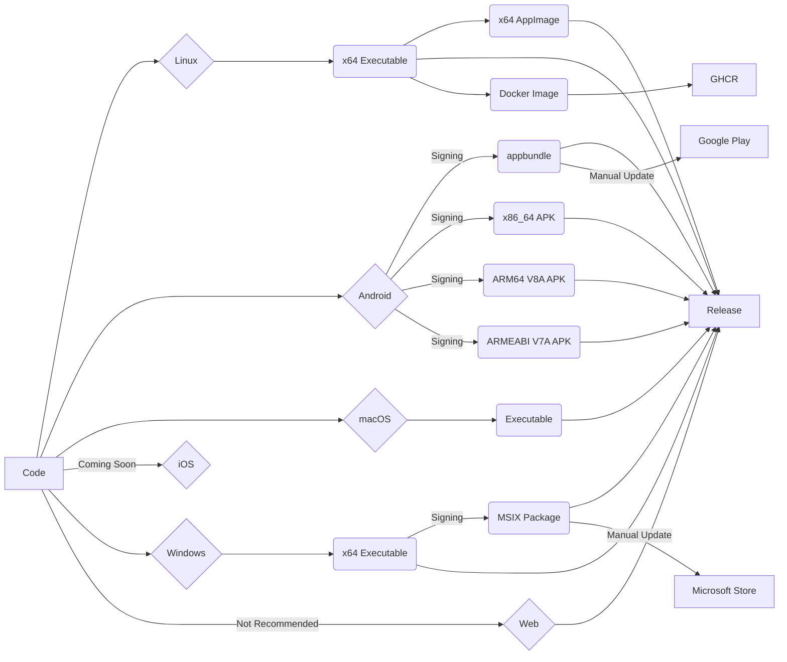

  

# Bitscoper Cyber ToolBox

A Flutter application consisting of TCP Port Scanner, Route Tracer, Pinger, File Hash Calculator, String Hash Calculator, Base Encoder, Morse Code Translator, Open Graph Protocol Data Extractor, Series URI Crawler, DNS Record Retriever, and WHOIS Retriever.

## Stores and Repositories

    
    
    

## [Releases](https://github.com/bitscoper/Bitscoper_Cyber_ToolBox/releases/)

Respective debug symbols are also uploaded for release.

## Tools

### 1. TCP Port Scanner

Scans ports from 0 to 65535 on a target server and reports the open ports.

### 2. Route Tracer

Traces the route to a target server, showing each hop along the route with its corresponding IP address.

### 3. Pinger

Pings a target server and reports the IP address, TTL, and time.

### 4. File Hash Calculator

Calculates MD5, SHA1, SHA224, SHA256, SHA384, and SHA512 hashes of files.

### 5. String Hash Calculator

Calculates MD5, SHA1, SHA224, SHA256, SHA384, and SHA512 hashes of a string.

### 6. Base Encoder

Encodes a string into binary (Base2), ternary (Base3), quaternary (Base4), quinary (Base5), senary (Base6), octal (Base8), decimal (Base10), duodecimal (Base12), hexadecimal (Base16), Base32, Base32Hex, Base36, Base58, Base62, Base64, and Base64 URL.

### 7. Morse Code Translator

Translates English to Morse code and vice versa.

### 8. Open Graph Protocol Data Extractor

Extracts Open Graph Protocol (OGP) data of an webpage.

### 9. Series URI Crawler

Crawls the available webpages in series by number and lists the available ones.

### 10. DNS Record Retriever

Retrieves A, AAAA, ANY, CAA, CDS, CERT, CNAME, DNAME, DNSKEY, DS, HINFO, IPSECKEY, NSEC, NSEC3PARAM, NAPTR, PTR, RP, RRSIG, SOA, SPF, SRV, SSHFP, TLSA, WKS, TXT, NS, and MX records of a domain name (forward) or an IP address (reverse).

### 11. WHOIS Retriever

Retrieves WHOIS information about a domain name.

## Configuration Commands

### Name

`flutter pub run rename setAppName --targets linux --value "Bitscoper_Cyber_ToolBox"`

`flutter pub run rename setAppName --targets android,macos,ios,windows,web --value "Bitscoper Cyber ToolBox"`

### ID

`flutter pub run rename setBundleId --targets linux,android,macos,ios,windows,web --value "bitscoper.bitscoper_cyber_toolbox"`

### Icon

`flutter pub run flutter_launcher_icons`

### Splash Screen

`flutter pub run flutter_native_splash:create`

### Android Keystore

`keytool -genkey -v -keystore ~/Laboratory/Bitscoper\ Cyber\ ToolBox/KeyStore.jks -keyalg RSA -keysize 4096 -validity 10000 -alias Bitscoper_Cyber_ToolBox`

`base64 ~/Laboratory/Bitscoper\ Cyber\ ToolBox/KeyStore.jks > ~/Laboratory/Bitscoper\ Cyber\ ToolBox/KeyStore.b64`
