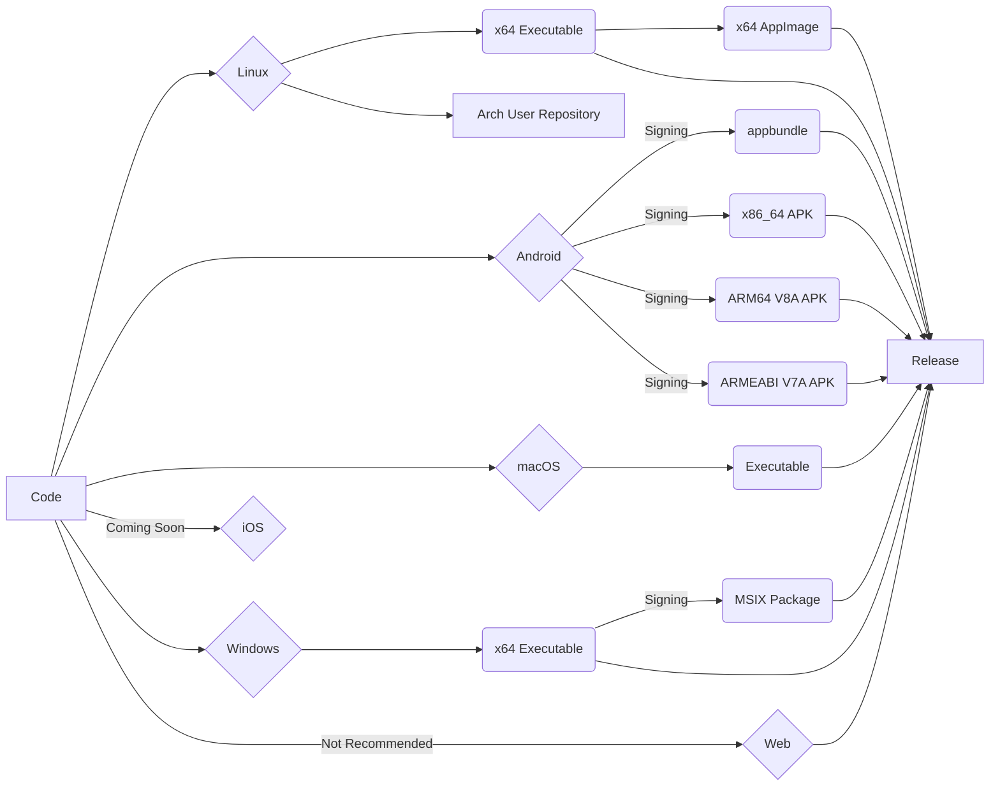

  

# Bitscoper Cyber ToolBox

A Flutter application consisting of TCP Port Scanner, Route Tracer, File Hash Calculator, String Encoder, Series URI Crawler, DNS Record Retriever, and WHOIS Retriever.

## Stores and Repositories

  
  
  

### Arch Linux

`yay -S --needed bitscoper-cyber-toolbox-bin`

## [Releases](https://github.com/bitscoper/Bitscoper_Cyber_ToolBox/releases/)

```mermaid
flowchart LR

Code[Code] --> Linux{Linux}
Linux --> Linux_x64_Executable(x64 Executable)
Linux_x64_Executable --> Linux_x64_AppImage(x64 AppImage)

Code --> Android{Android}
Android --> |Signing| Android_appbundle(appbundle)
Android --> |Signing| Android_x86_64_APK(x86_64 APK)
Android --> |Signing| Android_ARM64_V8A_APK(ARM64 V8A APK)
Android --> |Signing| Android_ARMEABI_V7A_APK(ARMEABI V7A APK)

Code --> macOS{macOS}
macOS --> macOS_Executable(Executable)

Code --> |Coming Soon| iOS{iOS}

Code --> Windows{Windows}
Windows --> Windows_x64_Executable(x64 Executable)
Windows_x64_Executable --> |Signing| Windows_x64_MSIX_Package(MSIX Package)

Code --> |Not Recommended| Web{Web}

Linux_x64_Executable --> Release[Release]
Linux_x64_AppImage --> Release[Release]
Android_appbundle --> Release[Release]
Android_x86_64_APK --> Release[Release]
Android_ARM64_V8A_APK --> Release[Release]
Android_ARMEABI_V7A_APK --> Release[Release]
macOS_Executable --> Release[Release]
Windows_x64_Executable --> Release[Release]
Windows_x64_MSIX_Package --> Release[Release]
Web --> Release[Release]

Linux --> AUR[Arch User Repository]
```

Respective debug symbols are also uploaded for release.

## Tools

### 1. TCP Port Scanner

Scans ports from 0 to 65535 on a target server and reports the open ports.

### 2. Route Tracer

Traces the route to a target IP address or domain name, showing each hop along the route with its corresponding IP address.

### 3. File Hash Calculator

Calculates MD5, SHA1, SHA224, SHA256, SHA384, and SHA512 hashes of files.

### 4. String Encoder

Encodes a string into binary (Base2), ternary (Base3), quaternary (Base4), quinary (Base5), senary (Base6), octal (Base8), decimal (Base10), duodecimal (Base12), hexadecimal (Base16), Base32, Base32Hex, Base36, Base58, Base62, Base64, and Base64 URL.

### 5. Series URI Crawler

Crawls the available webpages in series by number and lists the available ones.

### 6. DNS Record Retriever

Retrieves A, AAAA, ANY, CAA, CDS, CERT, CNAME, DNAME, DNSKEY, DS, HINFO, IPSECKEY, NSEC, NSEC3PARAM, NAPTR, PTR, RP, RRSIG, SOA, SPF, SRV, SSHFP, TLSA, WKS, TXT, NS, and MX records of a domain name (forward) or an IP address (reverse).

### 7. WHOIS Retriever

Retrieves WHOIS information of a domain name.
